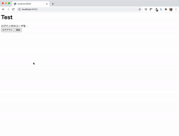
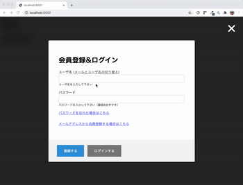
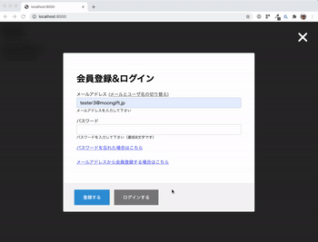

# NCMBの認証コンポーネント

NCMBの次の機能を提供するUIコンポーネントです。

- ID/パスワードログイン
- メールアドレス/パスワードログイン
- パスワードリマインダー
- メールアドレス会員登録

## デモ

モーダルを開いて、その中で認証処理やパスワードリマインダーを実行できます。



簡単な入力チェックを行えます。



認証が成功するとモーダルを閉じます。コールバックで認証したユーザ情報を受け取れます。



## 使い方

`dist/main.bundle.js` を読み込みます。

```html
<script src="/main.bundle.js"></script>
```

認証コンポーネントを初期化します。

```js
// NCMBのアプリケーションキーとクライアントキーです
const applicationKey = 'YOUR_APPLICATION_KEY';
const clientKey = 'YOUR_CLIENT_KEY';

// オプションです
const options = {
  auth_type: AuthType.ID
};

// 初期化します
const authComponent = new AuthComponent(applicationKey, clientKey, options);
```

認証用モーダルを呼び出します。

```js
authComponent.openModal(loginSuccess, loginFailure);

// ログイン成功時
  function loginSuccess(user) {
    console.log(user);
  }
  // エラー時
  function loginFailure(error) {
    console.log(error);
  }
```

認証情報はlocalStorageに保存されます。公式JavaScript SDK互換になります。

```js
const user = authComponent.getCurrentUser();
if (user) {
    // 表示
    document.querySelector('#user').innerHTML = user.get('userName');
}
```

## オプション

現状のオプションです。

```
AuthOptions {
  auth_type?: AuthType;    // AuthType.ID (ユーザID認証) / AuthType.Email （メールアドレス認証）
  password_min?: number; // パスワードの最低文字数（デフォルト8文字）
  title?: string; // モーダルのタイトル
}
```

## ライセンス

MIT License


